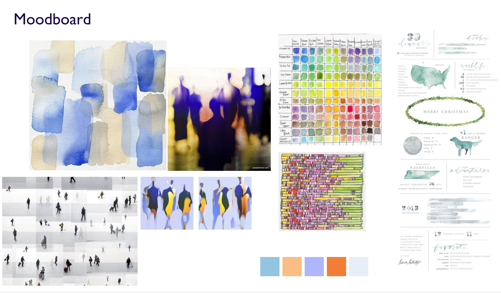

# Gender Gap in Time Use

This is the final interactive project at my Major Studio 1 class in collaboration with the UN. I picked Gender Equality as my umbrella theme.

### Concept and Inspiration

I was struck by this [scatterplot](https://ourworldindata.org/grapher/minutes-spent-on-leisure?time=latest) depicting gender gap in leisure time across the world published by _OCED Gender Data_ and visualized by _Our World in Data_ and I decided to build my visualization based on this data source.

Inspired by [Waitbutwhy](https://waitbutwhy.com/2014/05/life-weeks.html)'s Life-Weeks visualization, and many other time use visualizations by [FlowingData](https://flowingdata.com/tag/time-use/), I decided to use rectangles as the primary visual element representing time. To make the visualization more aesthetically exciting, I opted to layer on a watercolor, handdrawn theme to give it a low-tech touch.

### Design and Prototype

Based on my concept, I created a moodboard that features fluid, lightweight watercolor palette, and blurry abstract silhouettes.

### Moodboard

   

See [here](https://www.figma.com/file/vyBy3nNbMTu3WEkEARfrl6/Major-Studio-1-Project-3-Leisure-Second-Draft?node-id=0%3A1&t=yVt39wOLql6K6Pnh-0) for the initial Figma prototype.

### Technical Considerations

I also decided to take this opportunity to learn to build a project using d3 and Svelte. Through this introductory exercise, I learned some basic Svelte concepts such as loops, value binding, tween, scrollytelling, and props. The below technical components were implemented.

- Svelte scrollytelling
- Interactive d3 waffle chart
- Small multiples of d3 stacked bar chart
- Svelte tween animation
- SVG watercolor filter

### Current Iteration and Planned Changes

As of Dec 12, 2022, I deployed the preliminary version of the visualization with a few outstanding improvements in mind.

- Proper positioning of tooltip
- More refined tooltip formatting
- Responsive waffle and stacked bar charts

```js
// store.js
// An extremely simple external store
import { writable } from "svelte/store";
export default writable(0);
```
